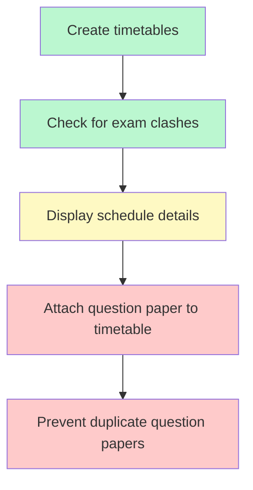

# My-first-project
Code-flowchart conversion
# Fit-Gap Analysis: Examination Scheduling

## Fit-Gap Table

| Process Step / Requirement (Client As-Is) | System Functionality (Our Product) | Fit / Gap | Notes / Action Items |
|-------------------------------------------|-------------------------------------|-----------|----------------------|
| **Create timetables** | Supports manual and automated timetable creation. | **Fit** | Matches client need for timetable creation; automation is an additional benefit not currently used by client. Training needed to leverage automation. |
| **Check for exam clashes** | Checks if a student has another paper at the same date/time **and blocks it**. | **Fit** | System provides stricter control by blocking scheduling — aligns with client intent but may require process adjustment for exceptions. |
| **Display schedule details (paper name, type, date/time, number of students)** | Displays some fields in UI (fields not fully listed). | **Partial Fit** | Need to confirm system UI matches all required fields from client’s process. Possible configuration change if missing. |
| **Attach question paper to timetable** | Feature exists in system. | **Gap** | Not part of client’s current process — requires process redesign to integrate feature. |
| **Prevent duplicate question papers** | No validation currently. | **Gap** | System limitation — manual process control needed or product enhancement required to add validation. |

---

## Fit-Gap Heatmap (GitHub Compatible)

---

**Legend:**
- **Green (Fit):** Fully supports client process  
- **Yellow (Partial):** Supports partially, needs configuration or minor changes  
- **Red (Gap):** Missing capability or not adopted in client process

