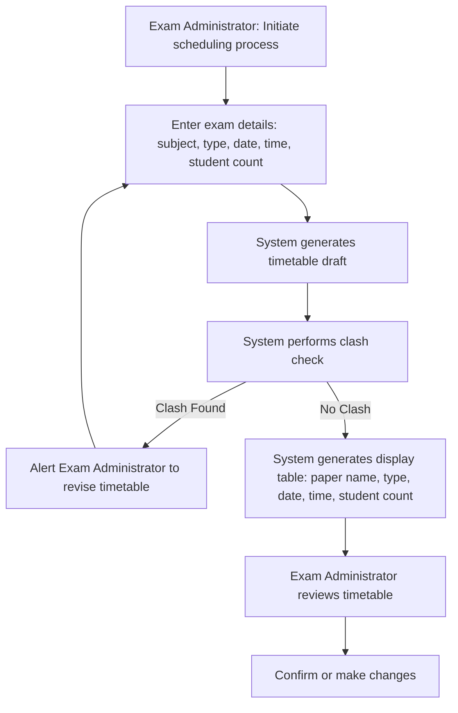

# My-first-project
Code-flowchart conversion

```mermaid
flowchart TD
    %% Define swimlanes using subgraphs
    subgraph EA[Exam Administrator]
        A[Initiate scheduling process]
        B[Enter exam details: subject, type, date, time, student count]
        G[Review timetable]
        H[Confirm or make changes]
    end

    subgraph SYS[System]
        C[Generate timetable draft]
        D[Perform clash check]
        E[Alert to revise timetable]
        F[Generate display table: paper name, type, date, time, student count]
    end

    %% Flow connections
    A --> B --> C --> D
    D -->|Clash Found| E --> B
```mermaid
graph TB
    A[Create timetables]:::fit --> B[Check for exam clashes]:::fit
    B --> C[Display schedule details]:::partial
    C --> D[Attach question paper to timetable]:::gap
    D --> E[Prevent duplicate question papers]:::gap

    classDef fit fill=#bbf7d0,stroke=#15803d,stroke-width=2px,color=#064e3b;       %% Green
    classDef partial fill=#fef9c3,stroke=#ca8a04,stroke-width=2px,color=#713f12;   %% Yellow
    classDef gap fill=#fecaca,stroke=#b91c1c,stroke-width=2px,color=#7f1d1d;       %% Red
```

    D -->|No Clash| F --> G --> H
```

