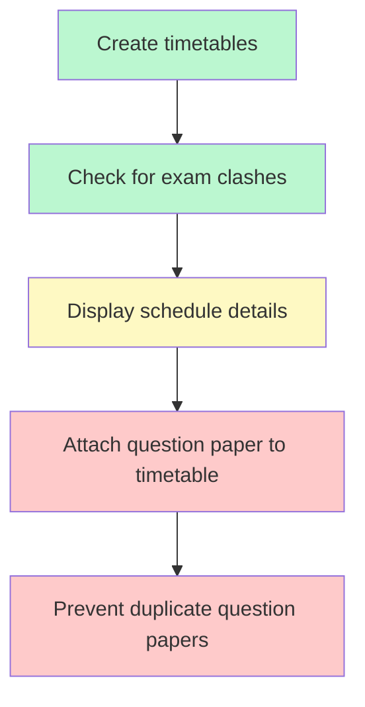

# My-first-project
Code-flowchart conversion

```mermaid
graph TB
    A[Create timetables]:::fit --> B[Check for exam clashes]:::fit
    B --> C[Display schedule details]:::partial
    C --> D[Attach question paper to timetable]:::gap
    D --> E[Prevent duplicate question papers]:::gap

    classDef fit fill:#bbf7d0;
    classDef partial fill:#fef9c3;
    classDef gap fill:#fecaca;
```
